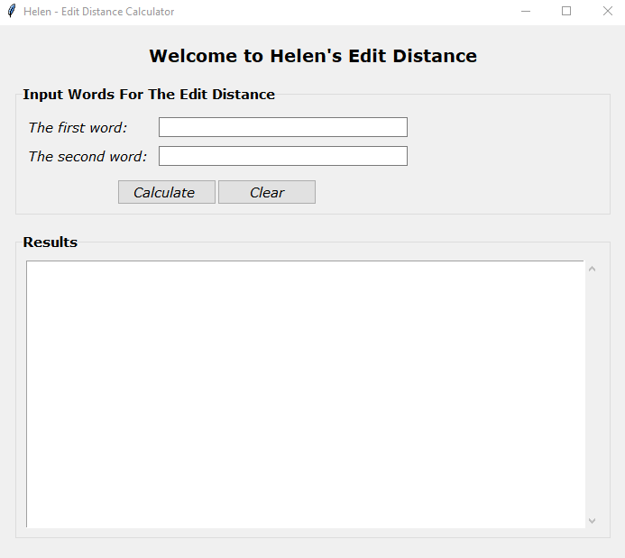

# Edit Distance Calculator

A Python program that calculates the edit distance (Levenshtein distance) between two words and displays the calculation matrix and alignment. Available in both command-line and graphical user interface (GUI) versions.

## Assignment Requirements

Programming Assignment (due Nov 21): Write a program to calculate the edit distance between two words and output both the matrix of distance calculation and an alignment that demonstrates the result.

## Features

- Calculates edit distance using dynamic programming
- Displays the complete calculation matrix with separators
- Shows an optimal alignment demonstrating the edit operations
- Available in two versions:
  - **Command-line interface** (edit_distance_1.py)
  - **Graphical user interface** (edit_distance_gui.py)

## How to Run

### GUI Version (Recommended)

Simply run the GUI version from the command line:

```bash
python edit_distance_gui.py
```

A window will pop up looking like this:
- Input fields for two words
- "Calculate" button to compute edit distance
- "Clear" button to reset all fields
- Scrollable results area showing the matrix and alignment
- Press Enter key in either input field to calculate




## Example Output

For the words "evaluation" and "elution":

```
The matrix:

     0   1   2   3   4   5   6   7
   --------------------------------
0 |  0:  1:  2:  3:  4:  5:  6:  7:
   --------------------------------
1 |  1:  0:  1:  2:  3:  4:  5:  6:
   --------------------------------
2 |  2:  1:  1:  2:  3:  4:  5:  6:
   --------------------------------
3 |  3:  2:  2:  2:  3:  4:  5:  6:
   --------------------------------
4 |  4:  3:  2:  3:  3:  4:  5:  6:
   --------------------------------
5 |  5:  4:  3:  2:  3:  4:  5:  6:
   --------------------------------
6 |  6:  5:  4:  3:  3:  4:  5:  6:
   --------------------------------
7 |  7:  6:  5:  4:  3:  4:  5:  6:
   --------------------------------
8 |  8:  7:  6:  5:  4:  3:  4:  5:
   --------------------------------
9 |  9:  8:  7:  6:  5:  4:  3:  4:
   --------------------------------
10 | 10:  9:  8:  7:  6:  5:  4:  3:
   --------------------------------

The edit distance is: 3

Alignment is:
evaluation
e__lu_tion
```

## How It Works

### Edit Distance Algorithm

The program uses dynamic programming to calculate the minimum number of single-character edits (insertions, deletions, or substitutions) needed to transform one word into another.

The matrix is built as follows:
- Rows represent characters from the first word (plus an empty string at row 0)
- Columns represent characters from the second word (plus an empty string at column 0)
- Each cell (i, j) contains the edit distance between the first i characters of word1 and the first j characters of word2

### Alignment

The alignment shows how the two words correspond to each other:
- Characters that match are aligned
- Underscores (_) represent insertions or deletions
- Mismatched characters show substitutions

In the example above:
- "evaluation" → "e__lu_tion" means:
  - Keep 'e'
  - Delete 'v' and 'a' (shown as underscores in word2)
  - Keep 'l', 'u'
  - Delete 'a' (shown as underscore in word2)
  - Keep 't', 'i', 'o', 'n'
- Total operations: 3 deletions = edit distance of 3

## Implementation Details

- Uses O(mn) space and time complexity where m and n are the lengths of the two words
- Traceback algorithm finds an optimal alignment path through the matrix
- Input is case-insensitive (converted to lowercase)
- Non-alphabetic characters are automatically filtered out

## GUI Features

The graphical version (edit_distance_gui.py) includes:
- **Clean, modern interface** with Verdana font styling
- **Input validation** with error messages for empty inputs
- **Keyboard shortcuts** - Press Enter to calculate
- **Clear button** to reset all fields and start over
- **Scrollable results** for viewing large matrices
- **Formatted output** with separator lines for better readability
- **Monospace font** (Courier) for matrix display to ensure proper alignment

## Testing

To test with different word pairs:

### Using GUI:
1. Run `python edit_distance_gui.py`
2. Type first word in the "The first word:" field
3. Type second word in the "The second word:" field
4. Click "Calculate" button (or press Enter)
5. View results in the scrollable area below

### Using Command-Line:

```bash
# Test 1: evaluation and elution
python edit_distance_1.py
# Enter: evaluation, elution
# Expected edit distance: 3

# Test 2: kitten and sitting  
python edit_distance_1.py
# Enter: kitten, sitting
# Expected edit distance: 3

# Test 3: saturday and sunday
python edit_distance_1.py
# Enter: saturday, sunday
# Expected edit distance: 3
```

## Files Included

- **edit_distance_1.py** - Command-line version with terminal interface
- **edit_distance_gui.py** - GUI version with graphical interface (Recommended)
- **README.md** - This documentation file

## Requirements

- Python 3.6 or higher
- tkinter (for GUI version - usually included with Python)

## Compilation and Testing Instructions

This program is written in Python, which is an interpreted language and does not require compilation. To run and test the program, you will need Python 3.6 or higher installed on your system. Python typically comes with tkinter pre-installed, which is required for the GUI version.

### Setting Up Your Environment:

**For Windows:**
1. Download and install Python from [python.org](https://www.python.org/downloads/)
2. During installation, make sure to check "Add Python to PATH"
3. Verify installation by opening Command Prompt (cmd) and typing:
   ```bash
   python --version
   ```
4. tkinter should be included by default. To verify, run:
   ```bash
   python -m tkinter
   ```
   A small window should appear if tkinter is properly installed.

**For macOS:**
1. Python 3 usually comes pre-installed. Check your version:
   ```bash
   python3 --version
   ```
2. If not installed, download from [python.org](https://www.python.org/downloads/) or install via Homebrew:
   ```bash
   brew install python3
   ```
3. tkinter is typically included with Python on macOS.

**For Linux (Ubuntu/Debian):**
1. Install Python 3 and tkinter:
   ```bash
   sudo apt-get update
   sudo apt-get install python3 python3-tk
   ```
2. Verify installation:
   ```bash
   python3 --version
   ```

### Running the Program:

**Option 1: GUI Version (Recommended)**
1. Open a terminal/command prompt
2. Navigate to the directory containing `edit_distance_gui.py`
3. Run the command:
   ```bash
   python edit_distance_gui.py
   ```
   or on some systems:
   ```bash
   python3 edit_distance_gui.py
   ```
4. A graphical window will appear. Enter your two words and click "Calculate" or press Enter.

**Option 2: Command-Line Version**
1. Open a terminal/command prompt
2. Navigate to the directory containing `edit_distance_1.py`
3. Run the command:
   ```bash
   python edit_distance_1.py
   ```
   or on some systems:
   ```bash
   python3 edit_distance_1.py
   ```
4. Follow the on-screen prompts to enter your words.

### Testing the Program:

To verify the program works correctly, test it with these known examples:

**Test Case 1:** evaluation → elution
- Expected edit distance: 3
- Input the words "evaluation" and "elution"
- The program should display a matrix and show edit distance of 3
- Alignment should show: `evaluation` and `e__lu_tion`

**Test Case 2:** kitten → sitting
- Expected edit distance: 3
- Input the words "kitten" and "sitting"
- The alignment should show the transformation with underscores for gaps

**Test Case 3:** saturday → sunday
- Expected edit distance: 3
- Tests substitution and deletion operations

**Edge Cases to Test:**
- Identical words (e.g., "hello" and "hello") - should give edit distance 0
- Completely different words of different lengths
- Single character words
- Words with mixed case (program converts to lowercase automatically)

### Troubleshooting:

**Problem:** "python is not recognized as an internal or external command"
- **Solution:** Python is not in your system PATH. Try using `py` instead of `python`, or reinstall Python with "Add to PATH" checked.

**Problem:** "No module named 'tkinter'" when running GUI version
- **Solution (Windows):** Reinstall Python, ensuring "tcl/tk and IDLE" is checked during installation
- **Solution (Linux):** Install tkinter with `sudo apt-get install python3-tk`
- **Solution (macOS):** tkinter should be included; if not, reinstall Python from python.org

**Problem:** GUI window doesn't appear
- **Solution:** Try running from terminal/command prompt instead of an IDE, or check if your system supports GUI applications

### Development Environment:

This program was developed and tested using:
- Python 3.8+
- tkinter 8.6+
- Windows 11, but is cross-platform compatible

No additional external libraries or packages are required beyond the Python standard library.

## Author

Helen Truong
Created for Programming Assignment due Nov 21
